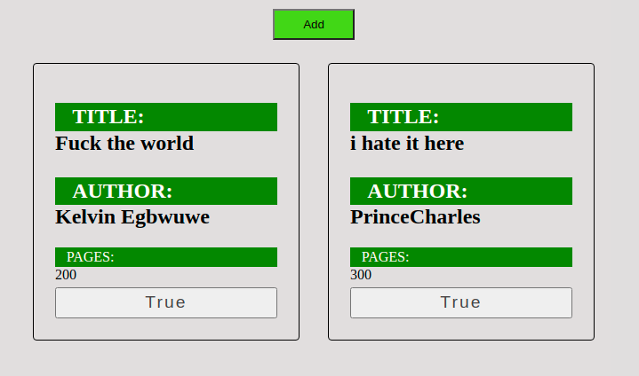

# Project Title

## Table of Contents

- [About](#about)
- [Getting Started](#getting_started)
- [Usage](#usage)

## About 

This Project was developed in response to a challenge on The Odin Priject website where anyone can learn web development for free.

## Getting Started 

To get started using the file simply fork the project and run it on your local machine to get acces to it.

Alternatively you can navigate to the live Preview and use the app durectly in your browser <a href="https://prince-hope1975.github.io/books/">here.</a>
<!-- These instructions will get you a copy of the project up and running on your local machine for development and testing purposes. See [deployment](#deployment) for notes on how to deploy the project on a live system. -->

### Prerequisites

To use this app all you need us Your web browser and you're ready to go

### Installing

End with an example of getting some data out of the system or using it for a little demo.

## Demo Screenshot

